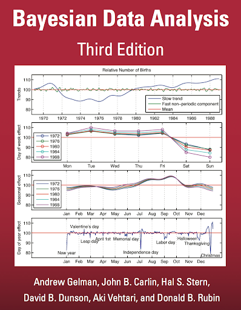
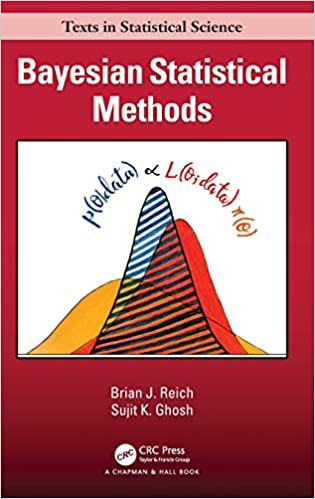

```{r setup, include=FALSE}
knitr::opts_chunk$set(echo = TRUE)
```

# Introducción

El tipo más simple de **datos multinivel** tiene **dos niveles**, a saber, **grupos** y **unidades dentro de los grupos**. 

Se denota con $y_{i,j}$ la observación de la unidad $i$ en el grupo $j$, para $i = 1,\ldots,n_j$ y $j=1,\ldots,m$, donde $m$ es el número de grupos y $n = \sum_{j=1}^m n_j$ es el tamaño de la muestra.

El **conjunto de datos** es $\boldsymbol{y} = (\boldsymbol{y}_1,\ldots,\boldsymbol{y}_m)$, donde $\boldsymbol{y}_j=(y_{1,j},\ldots,y_{n_j,j})$ son las observaciones del grupo $j$, para $j=1,\ldots,m$.


# Modelo

Un modelo popular para caracterizar la **heterogeneidad de las medias** en varias poblaciones es el **modelo jerárquico Normal**, en el cual la **variabilidad dentro y entre** se modela usando **distribuciones Normales**:

- Caracterización **dentro** de los grupos:
$$
y_{i, j}\mid\theta_j,\sigma^2 \stackrel{\text {iid}}{\sim} \textsf{N}\left(\theta_j,\sigma_j^2\right)
$$
- Caracterización **entre** los grupos:
$$
\theta_{j}\mid\mu,\tau^2 \stackrel{\text {iid}}{\sim} \textsf{N}\left(\mu,\tau^2\right)
$$
$$
\sigma_j^2\mid\nu,\sigma^2 \stackrel{\text {iid}}{\sim}\textsf{GI}\left(\tfrac{\nu}{2},\tfrac{\nu\,\sigma^2}{2}\right)
$$

- Distribución **previa**:
$$
p(\mu,\tau^2,\nu,\sigma^2) = p(\mu)\,p(\tau^2)\,p(\nu)\,p(\sigma^2)
$$
donde
$$
\mu\sim\textsf{N}(\mu_0,\gamma_0^2)\qquad\tau^2\sim\textsf{GI}\left(\tfrac{\eta_0}{2},\tfrac{\eta_0\,\tau^2_0}{2}\right)
\qquad p(\nu)\propto e^{-\lambda_0\,\nu}\qquad \sigma^2\sim\textsf{Gamma}(\alpha_0,\beta_0)
$$
- Los **parámetros** del modelo son $\boldsymbol{\theta}=(\theta_1,\ldots,\theta_m,\sigma^2_1,\ldots,\sigma^2_m,\mu,\tau^2,\nu,\sigma^2)$.

- Los **hiperparámetros** del modelo son $(\mu_0,\gamma_0^2,\eta_0,\tau^2_0, \lambda_0,\alpha_0,\beta_0)$.


# Estimación

Desarrollar un **muestreador de Gibbs** para obtener muestras de la distribución posterior $p(\boldsymbol{\theta}\mid\boldsymbol{y})$.

- Distribución **posterior**:
$$
\begin{aligned}
p(\boldsymbol{\theta} \mid \boldsymbol{y}) &\propto p(\boldsymbol{y} \mid \boldsymbol{\theta})\, p(\boldsymbol{\theta}) \\
&= \prod_{j=1}^m\prod_{i=1}^{n_j} \textsf{N}\left(y_{i, j} \mid \theta_{j}, \sigma^{2}\right) \\
&\quad\quad\times \prod_{j=1}^m \textsf{N}\left(\theta_{j} \mid \mu, \tau^{2}\right) \times \prod_{j=1}^m \textsf{GI}\left(\sigma^2_{j} \mid \tfrac{\nu}{2}, \tfrac{\nu\,\sigma^{2}}{2}\right) \\
&\quad\quad\quad\times \textsf{N}\left(\mu \mid \mu_{0}, \gamma_{0}^{2}\right) \times \textsf{GI}\left(\tau^{2} \mid \tfrac{\eta_{0}}{2}, \tfrac{\eta_{0}\,\tau_{0}^{2}}{2}\right) \\
&\quad\quad\quad\quad\times e^{-\lambda_0\,\nu} \times \textsf{G}(\sigma^2\mid\alpha_0,\beta_0)
\end{aligned}
$$

Distribuciones **condicionales completas**:
$$
\begin{aligned}
\theta_{j} \mid \text { resto } &\sim\textsf{N}\left(\frac{\mu / \tau^{2} + n_{j} \bar{y}_{j} / \sigma_j^{2}}{1 / \tau^{2} + n_{j} /\sigma_j^{2}}, \frac{1}{1 / \tau^{2} + n_{j} /\sigma_j^{2}}\right) \\
\sigma_{j}^{2} \,\mid\, \text { resto } &\sim\textsf{GI}\left(\frac{\nu+n_{j}}{2}, \frac{\nu \sigma^{2}+\sum_{i=1}^{n_j}\left(y_{i, j}-\theta_{j}\right)^{2}}{2}\right) \\
\mu \mid \text { resto } &\sim\textsf{N}\left(\frac{\mu_{0} / \gamma_{0}^{2} + m \bar{\theta} / \tau^{2}}{1 / \gamma_{0}^{2} + m / \tau^{2}}, \frac{1}{1 / \gamma_{0}^{2} + m / \tau^{2}}\right) \\
\tau^{2} \mid \text { resto } &\sim\textsf{ GI }\left(\frac{\eta_{0}+m}{2}, \frac{\eta_{0} \tau_{0}^{2}+\sum_{j=1}^m\left(\theta_{j}-\mu\right)^{2}}{2}\right)\\
\sigma^{2} \mid \text { resto }&\sim\textsf{G}\left(\alpha_0+\frac{m \nu}{2},  \beta_0+\frac{\nu}{2} \sum_{j=1}^m \frac{1}{\sigma_{j}^2}\right) 
\end{aligned}
$$
La distribución condicional completa de $\nu$ **no tiene una forma cerrada** conocida:
$$
p\left(\nu \mid \text { resto }\right) \propto\left[\frac{\left(\nu\,\sigma^{2} / 2\right)^{\nu / 2}}{\Gamma\left(\nu / 2\right)}\right]^{m}\left[\prod_{j=1}^m \frac{1}{\sigma_j^{2}}\right]^{\nu / 2} {\exp}\left\{-\nu\left(\lambda_0 + \frac{\sigma^{2}}{2} \sum_{j=1}^m \frac{1}{\sigma_{j}^{2}}\right)\right\}\,,
$$
o en escala log,
$$
\log p\left(\nu \mid \text { resto }\right) \propto \frac{m\,\nu}{2} \log(\nu\,\sigma^{2} / 2) - m\log\Gamma(\nu/2) -\frac{\nu}{2} \sum_{j=1}^m \log(\sigma_j^{2}) - \nu\left(\lambda_0 + \frac{\sigma^{2}}{2} \sum_{j=1}^m \frac{1}{\sigma_{j}^{2}}\right)\,.
$$

Para muestrear valores de $p(\nu \mid \text{resto})$ se calcula esta distribución en escala log para un rango de valores de $\nu$, se normaliza la distribución discreta resultante, y luego se simula del rango de valores establecido de acuerdo con las probabilidades obtenidas.


# Ejemplo: Puntajes de Matemáticas

Los conjuntos de datos de los archivos `SB11_1.txt` contiene una muestra aleatoria del **código del departamento de ubicación del colegio** y el **puntaje de matemáticas de los estudiantes que presentaron la Prueba Saber 11 del primer semestre de 2020**. Estos datos son de carácter público y están disponibles en https://www.icfes.gov.co. 

La prueba de matemáticas se obtiene mediante un **modelo 3PL** (modelo logístico de 3 parámetros que define la probabilidad de responder correctamente de un individuo, en función de su habilidad, la dificultad del ítem, la discriminación del ítem y el pseudo-azar) y tiene una **escala de 0 a 100** (sin decimales), con **puntaje promedio de 50 puntos** y **desviación estándar 10 puntos**.

El objetivo es **construir un modelo predictivo para el puntaje de matemáticas a nivel nacional**, tomando como datos de entrenamiento los resultados del primer semestre de 2020, con el fin de **hacer inferencias sobre la población de estudiantes tanto a nivel nacional como departamental**. Por lo tanto, se toma como variable de agrupamiento el departamento de ubicación del colegio del estudiante. 


## Estructura de los datos


- $y_{i,j}$:       puntaje de matemáticas del estudiante $i$ y en departamento $j$.
- $n_j\,\,$:       número de estudiantes en el departamento $j$.
- $\bar{y}_j\,\,$: promedio muestral del departamento $j$.
- $s^2_j\,\,$:     varianza muestral del departamento $j$.


```{r}
# paquetes
suppressMessages(suppressWarnings(library(dplyr))) 
suppressMessages(suppressWarnings(library(ggplot2))) 
```


```{r}
# datos
SB11_1 <- read.csv("SB11_1_muestra.txt", sep="", fileEncoding = "UTF-8")
dim(SB11_1)
```


```{r}
# código departamentos
# https://www.fopep.gov.co/wp-content/uploads/2019/02/Tabla-C%C3%B3digos-Dane.pdf
codigo <- c(5, 8, 11, 13, 15, 17, 18, 19, 20, 23, 25, 27, 41, 44, 47, 50, 52, 54, 63, 66, 68, 70, 73, 76, 81, 85, 86, 88, 91, 94, 95, 97, 99)
nombre <- c("ANTIOQUIA", "ATLANTICO", "BOGOTA", "BOLIVAR", "BOYACA", "CALDAS", "CAQUETA", "CAUCA", "CESAR", "CORDOBA", "CUNDINAMARCA", "CHOCO", "HUILA", "LA GUAJIRA", "MAGDALENA", "META", "NARINO", "N. SANTANDER", "QUINDIO", "RISARALDA", "SANTANDER", "SUCRE", "TOLIMA", "VALLE DEL CAUCA", "ARAUCA", "CASANARE", "PUTUMAYO", "SAN ANDRES", "AMAZONAS", "GUAINIA", "GUAVIARE", "VAUPES", "VICHADA")
deptos <- data.frame(codigo, nombre)
# base de datos con nombres
SB11_1 <- left_join(x = SB11_1, y = deptos, by = "codigo")
# número de estudiantes por departamento
table(SB11_1$nombre)
# remover departamentos con un solo estudiante
SB11_1 <- SB11_1[SB11_1$nombre != "ARAUCA",]
```


```{r}
# m : número de grupos (departamentos)
# n : número de individuos (estudiantes)
(m <- length(table(SB11_1$codigo)))
(n <- sum(table(SB11_1$codigo)))
```


```{r}
# tratamiento de datos
# y  : puntaje de los estudiantes (c)
# Y  : puntaje de los estudiantes (list)
# g  : identificador secuencial de los departamentos (c)
# nj : número de estudiantes por departamento (c)
# yb : promedios por departamento (c)
# s2 : varianzas por departamento (c)
y <- SB11_1$puntaje
Y <- vector(mode = "list", length = m)
g <- rep(NA, n)
for (j in 1:m) {
  idx <- SB11_1$codigo == unique(SB11_1$codigo)[j]
  g[idx] <- j
  Y[[j]] <- y[idx]
}
# tabla
estadisticos <- SB11_1 %>% 
  group_by(codigo) %>% 
  summarise(codigo = unique(codigo), 
            nombre = unique(nombre), 
            nj = n(), 
            yb = mean(puntaje), 
            s2 = var(puntaje))
```


```{r}
head(estadisticos, n = 5)
```


```{r}
# estadísticos
nj <- estadisticos$nj
yb <- estadisticos$yb
s2 <- estadisticos$s2
```


## Distribución previa


Teniendo en cuenta la información de la prueba, el modelo se ajusta utilizando los siguientes hiperparámetros: 
$$
\mu_0 = 50\,,\qquad
\gamma^2_0 = 25\,,\qquad
\eta_0 = 1\,,\qquad
\tau^2_0 = 100\,,\qquad
\lambda_0 = 1\,,\qquad
\alpha_0 = 1\,,\qquad
\beta_0 = 1/100\,.
$$

```{r}
  # hiperparámetros
  mu0  <- 50 
  g20  <- 25
  eta0 <- 1  
  t20  <- 100
  lam0 <- 1  
  al0  <- 1
  be0  <- 1/100 
  nus0 <- 1:50  # rango en p(nu | rest)
```


## Ajuste del modelo


```{r, echo = F}
# algoritmo modelo 1
MCMC_1 <- function(B, nj, yb, s2) {
  # tamaños
  n <- sum(nj)
  m <- length(nj)
  # hiperparametros
  mu0  <- 50 
  g20  <- 25
  eta0 <- 1  
  t20  <- 100
  nu0  <- 1  
  s20  <- 100
  # valores iniciales
  theta <- yb
  sig2  <- mean(s2)
  mu    <- mean(theta)
  tau2  <- var(theta)
  # almacenamiento
  THETA <- matrix(data = NA, nrow = B, ncol = m+3)
  LL    <- matrix(data = NA, nrow = B, ncol = 1)
  # cadena
  for (b in 1:B) {
    # actualizar theta
    vtheta <- 1/(1/tau2 + nj/sig2)
    theta  <- rnorm(n = m, mean = vtheta*(mu/tau2 + nj*yb/sig2), sd = sqrt(vtheta))
    # actualizar sigma^2
    sig2 <- 1/rgamma(n = 1, shape = 0.5*(nu0 + n), rate = 0.5*(nu0*s20 + sum((nj-1)*s2 + nj*(yb - theta)^2)))
    # actualizar mu
    vmu <- 1/(1/g20 + m/tau2)
    mu  <- rnorm(n = 1, mean = vmu*(mu0/g20 + m*mean(theta)/tau2), sd = sqrt(vmu)) 
    # actualizar tau^2
    tau2 <- 1/rgamma(n = 1, shape = 0.5*(eta0 + m), rate = 0.5*(eta0*t20 + (m-1)*var(theta) + m*(mean(theta) - mu)^2))
    # almacenar valores
    THETA[b,] <- c(theta, sig2, mu, tau2)
    # log-verosimilitud
    LL[b] <- sum(dnorm(x = y, mean = rep(theta, nj), sd = sqrt(sig2), log = T))
  }
  # fin de la cadena
  # salida
  colnames(THETA) <- c(paste0("theta",1:m), "sig2", "mu", "tau2")
  colnames(LL) <- c("ll")
  THETA <- as.data.frame(THETA)
  LL    <- as.data.frame(LL)
  return(list(THETA = THETA, LL = LL))
}
```


```{r}
# algoritmo modelo 2
MCMC_2 <- function(B, nj, yb, s2, mu0, g20, eta0, t20, lam0, al0, be0, nus0) {
  # tamaños
  n <- sum(nj)
  m <- length(nj)
  # valores iniciales
  theta <- yb
  sig2  <- s2  # sigma_j^2
  mu    <- mean(theta)
  tau2  <- var(theta)
  nu    <- 1
  ups2  <- 100  # sigma^2
  # almacenamiento
  THETA <- matrix(data = NA, nrow = B, ncol = 2*m+4)
  LL    <- matrix(data = NA, nrow = B, ncol = 1)
  # cadena
  for (b in 1:B) {
    # actualizar theta
    vtheta <- 1/(1/tau2 + nj/sig2)
    theta  <- rnorm(n = m, mean = vtheta*(mu/tau2 + nj*yb/sig2), sd = sqrt(vtheta))
    # actualizar sigma_j^2
    sig2 <- 1/rgamma(n = m, shape = 0.5*(nu + nj), rate = 0.5*(nu*ups2 + (nj-1)*s2 + nj*(yb - theta)^2))
    # actualizar mu
    vmu <- 1/(1/g20 + m/tau2)
    mu  <- rnorm(n = 1, mean = vmu*(mu0/g20 + m*mean(theta)/tau2), sd = sqrt(vmu))
    # actualizar tau2
    tau2 <- 1/rgamma(n = 1, shape = 0.5*(eta0+m), rate = 0.5*(eta0*t20 + (m-1)*var(theta) + m*(mean(theta) - mu)^2))
    # actualizar nu
    lpnu <- 0.5*m*nus0*log(0.5*nus0*ups2) - m*lgamma(0.5*nus0) - 0.5*nus0*sum(log(sig2)) - nus0*(lam0 + 0.5*ups2*sum(1/sig2))
    nu <- sample(x = nus0, size = 1, prob = exp(lpnu - max(lpnu)))
    # actualizar sigma^2
    ups2 <- rgamma(n = 1, shape = al0 + 0.5*m*nu, rate = be0 + 0.5*nu*sum(1/sig2))
    # almacenar
    THETA[b,] <- c(theta, sig2, mu, tau2, nu, ups2)
    # log-verosimilitud
    LL[b] <- sum(dnorm(x = y, mean = rep(theta, nj), sd = sqrt(rep(sig2, nj)), log = T))
  }
  # fin de la cadena
  # salida
  colnames(THETA) <- c(paste0("theta", 1:m), paste0("sig2", 1:m), "mu", "tau2", "nu", "ups2")
  colnames(LL) <- c("ll")
  THETA <- as.data.frame(THETA)
  LL    <- as.data.frame(LL)
  return(list(THETA = THETA, LL = LL))
}
```


```{r, echo = F}
# ajuste del modelo 1
set.seed(1)
chain_M1 <- MCMC_1(B = 100000, nj, yb, s2)
```


```{r}
# ajuste del modelo 2
tictoc::tic()
set.seed(1)
chain_M2 <- MCMC_2(B = 100000, nj, yb, s2, mu0, g20, eta0, t20, lam0, al0, be0, nus0)
tictoc::toc()
```


## Convergencia

```{r, fig.width=10, fig.height=3.5, fig.align='center'}
# cadenas
col <- RColorBrewer::brewer.pal(9,"Set1")[1:9]
yrange <- range(chain_M1$LL$ll, chain_M2$LL$ll)
par(mfrow = c(1,2), mar = c(2.75,2.75,1.5,0.5), mgp = c(1.7,0.7,0))
plot(chain_M1$LL$ll, type = "p", pch = ".", cex = 1.1, col = col[1], ylim = yrange, xlab = "Iteración", ylab = "Log-verosimilitud", main = "Modelo 1")
plot(chain_M2$LL$ll, type = "p", pch = ".", cex = 1.1, col = col[2], ylim = yrange, xlab = "Iteración", ylab = "Log-verosimilitud", main = "Modelo 2")
```


```{r}
# tamaños efectivos de muestra
neff_M1 <- coda::effectiveSize(chain_M1$THETA)
summary(neff_M1)
neff_M2 <- coda::effectiveSize(chain_M2$THETA)
summary(neff_M2)
```


```{r}
# errores estándar de MC
EEMC_M1 <- apply(X = chain_M1$THETA, MARGIN = 2, FUN = sd)/sqrt(neff_M1)
round(summary(EEMC_M1), 3)
EEMC_M2 <- apply(X = chain_M2$THETA, MARGIN = 2, FUN = sd)/sqrt(neff_M2)
round(summary(EEMC_M2), 3)
```


```{r, echo = F, fig.width=4, fig.height=4, fig.align='center'}
# errores estándar de MC 
col <- RColorBrewer::brewer.pal(9,"Set1")[1:9]
par(mfrow = c(1,1), mar = c(2.75,2.75,1.5,0.5), mgp = c(1.7,0.7,0))
boxplot(EEMC_M1, EEMC_M2, outline = F, xlim = c(0,3), ylim = range(EEMC_M1,EEMC_M2), col = 0, border = c(col[1],col[2]), boxwex = 0.4, main = "Errores Estándar de MC")
axis(side = 1, at = 1:2, labels = c("Modelo 1","Modelo 2"),  cex.axis = 0.8)
lines(x = jitter(x = rep(1,length(EEMC_M1)), amount = .1), y = EEMC_M1, type = "p", pch = 20, col = adjustcolor(col[1], 0.3), cex = 1.3)
lines(x = jitter(x = rep(2,length(EEMC_M2)), amount = .1), y = EEMC_M2, type = "p", pch = 20, col = adjustcolor(col[2], 0.3), cex = 1.3)
```


## Inferencia


```{r, echo = F, fig.width=7, fig.height=7, fig.align='center'}
# gráficos
col <- RColorBrewer::brewer.pal(9,"Set1")[1:9]
par(mfrow = c(2,2), mar = c(2.75,2.75,2.0,0.5), mgp = c(1.7,0.7,0))
# posterior mu
plot (density(chain_M1$THETA$mu), col = col[1], xlab=expression(mu), ylab = "Densidad", main = expression(mu))
lines(density(chain_M1$THETA$mu), col = col[1])
lines(density(chain_M2$THETA$mu), col = col[2])
# posterior tau^2
plot (density(chain_M1$THETA$tau2), col = col[1], xlab=expression(tau^2), ylab = "Densidad", main = expression(tau^2))
lines(density(chain_M1$THETA$tau2), col = col[1])
lines(density(chain_M2$THETA$tau2), col = col[2])
legend("topright", legend = c("Modelo 1","Modelo 2"), col = col[1:2], lty = 1, lwd = 2, bty = "n")
# posterior nu
plot (1:15, as.numeric(table(factor(x = chain_M2$THETA$nu, levels = 1:15)))/25000, type = "b", pch = 20, col = col[2], xlab = expression(nu), ylab = "Densidad", main = expression(nu))
abline(h = 0, col = "lightgray")
# posterior sigma^2
plot (density(chain_M2$THETA$ups2), col = col[2], xlab = expression(sigma^2), ylab = "Densidad", main = expression(sigma^2))
```


```{r, echo = F, fig.width=4, fig.height=4, fig.align='center'}
# medias posteriores Modelo 2 vs. Modelo 1
theta_hat_M1 <- colMeans(chain_M1$THETA[,1:m])
theta_hat_M2 <- colMeans(chain_M2$THETA[,1:m])
rango <- range(theta_hat_M1, theta_hat_M2)
par(mfrow = c(1,1), mar = c(2.75,2.75,1.5,0.5), mgp = c(1.7,0.7,0))
plot(NA, NA, xlim = rango, ylim = rango, xlab = "Medias Modelo 1", ylab = "Medias Modelo 2", main = "Modelo 2 vs. Modelo 1")
abline(a = 0, b = 1, lty = 2, col = 2)
lines(theta_hat_M1, theta_hat_M2, type = "p", pch = 16, cex = 1.3, col = adjustcolor(1, 0.6))
```


## Ranking


```{r, echo = F, fig.width=16, fig.height=10, fig.align='center'}
# ranking bayesiano: Modelo 1
THETA <- chain_M1$THETA
ids2  <- estadisticos$nombre
that  <- colMeans(THETA[,1:m])
ic1   <- apply(X = THETA[,1:m], MARGIN = 2, FUN = function(x) quantile(x, c(0.025,0.975)))
ranking <- order(that) 
ids2 <- ids2[ ranking]
that <- that[ ranking]
ic1  <- ic1 [,ranking]
colo <- rep(2,m)
colo[which(ic1[1,]>50)] <- 1
colo[which(ic1[2,]<50)] <- 3
colo <- c("royalblue","black","red")[colo]
# grafico
par(mfrow = c(1,2), mar = c(4,10,1.5,1), mgp = c(2.5,0.75,0))
plot(NA, NA, xlab = "Puntaje", ylab = "", main = "Ranking Bayesisano: Modelo 1", xlim = c(0,100), ylim = c(1,m), cex.axis = 0.75, yaxt = "n")
axis(side = 2, at = 1:m, labels = ids2, las = 2)
abline(v = 50,  col = "gray", lwd = 3)
abline(h = 1:m, col = "lightgray", lwd = 1)
for (j in 1:m) {
  segments(x0 = ic1[1,j], y0 = j, x1 = ic1[2,j], y1 = j, col = colo[j])
  lines(x = that[j], y = j, type = "p", pch = 16, cex = 0.8, col = colo[j])
}
# ranking bayesiano: Modelo 2
THETA <- chain_M2$THETA
ids2  <- estadisticos$nombre
that  <- colMeans(THETA[,1:m])
ic1   <- apply(X = THETA[,1:m], MARGIN = 2, FUN = function(x) quantile(x, c(0.025,0.975)))
ranking <- order(that) 
ids2 <- ids2[ ranking]
that <- that[ ranking]
ic1  <- ic1 [,ranking]
colo <- rep(2,m)
colo[which(ic1[1,]>50)] <- 1
colo[which(ic1[2,]<50)] <- 3
colo <- c("royalblue","black","red")[colo]
# grafico
plot(NA, NA, xlab = "Puntaje", ylab = "", main = "Ranking Bayesisano: Modelo 2", xlim = c(0,100), ylim = c(1,m), cex.axis = 0.75, yaxt = "n")
axis(side = 2, at = 1:m, labels = ids2, las = 2)
abline(v = 50,  col = "gray", lwd = 3)
abline(h = 1:m, col = "lightgray", lwd = 1)
for (j in 1:m) {
  segments(x0 = ic1[1,j], y0 = j, x1 = ic1[2,j], y1 = j, col = colo[j])
  lines(x = that[j], y = j, type = "p", pch = 16, cex = 0.8, col = colo[j])
}
```


# Referencias {-}

```{r, eval = TRUE, echo=FALSE, out.width="25%", fig.pos = 'H', fig.align = 'center'}
knitr::include_graphics("Hoffcoverbook.jpg")
```


```{r, eval = TRUE, echo=FALSE, out.width="25%", fig.pos = 'H', fig.align = 'center'}

```


```{r, eval = TRUE, echo=FALSE, out.width="25%", fig.pos = 'H', fig.align = 'center'}

```